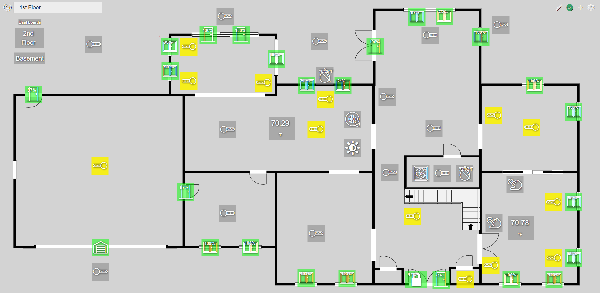

# Hubitat Dashboard Editor
An enhanced dashboard editor for hubitat to layout over a background image such as a floorplan.  The editor changes the CSS for the dashboard.  The dashboard can then be accessed normally.  THIS WILL OVERWRITE ANY EXISTING CUSTOM CSS.

## Installation
On you hubitat, upload DashEd.html using Settings/File Manager.

## Setting the Background Image
* Upload your background image using Settings/File Manager.
* Then set the background for the dashboard to the uploaded image.
[Dashboard Documentation](https://docs.hubitat.com/index.php?title=Hubitat%E2%84%A2_Dashboard)

I strongly recommend using SVG images to allow them to scale to different screen sizes.  You may need to edit the SVG to have it scale well.  Update the svg element with these values:
* height="auto"
* width="auto"
* preserveAspectRatio="none"

## Usage
* Open http://{hubitat ip address}/local/DashEd.html
* Select the dashboard you wish to edit in the top left dropdown.
* In the top right corner, start edit mode by clicking the new edit icon in the top right corner.
    * If this is the first time editing a dashboard, click the save icon once to get a base CSS set.
    * Then click the edit button again
* Add a tile using the normal tile add process.  The tile should appear in the middle of the screen.
* Drag the tile to the desired location
* Repeat
* Click the save icon in the top right corner
